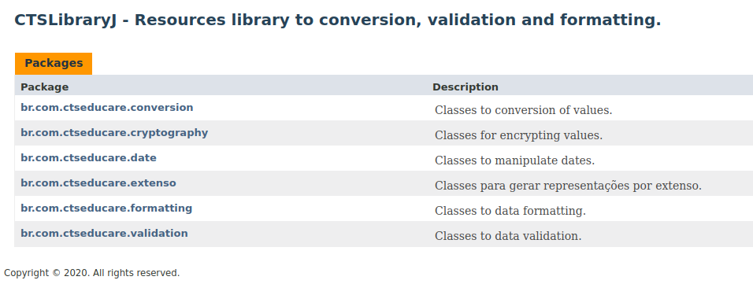

# CTSLibraryJ

## Description

The CTSLibraryJ is a Java project that contens several routines to manipulation of strings and numbers.

## Features of Library

* Use Apache Maven as manager build
* Javadoc tool to generate library documentation
* Unit tests with JUnit framework

## Resources of Library

+ Conversion of values
+ Data manipulation
+ Extenso
+ Formatting of values
+ Validation of values

## Screenshot

## Release history

* 1.0.0
    * First release
